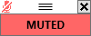
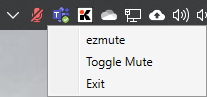

# ezmute 
*(easy mute)*


A configurable and easy to use way to mute your microphone/input devices on Windows Vista, 8, and 10

## What can it do?
- Provides a super quick way to mute and unmute your input devices including microphones at the operating system level
- Provides a configurable button to mute/unmute your input devices
- Provides configurable hot keys to toggle mute
- Shows current status by text and colour in the main window
- Shows current status in the "system tray"/notification area
- Shows current status in the start bar
- Supports always on top
- Mute status shown in Microsoft Teams
- Can configure the size of the app, starting position, font size and colours

## Whats it look like?
All the colours are configurable, but heres a sample:

  

 

## Installation
Just download from the releases tab, edit the config.json and run the exe. There are four versions available:

| Name | Description |
| -- | -- |
| *-win-x64 | 64 bit version. Requires [net core 3.1 runtime](https://dotnet.microsoft.com/download/dotnet-core/3.1) or later. |
| *-win-x86 | 32 bit version. Requires [net core 3.1 runtime](https://dotnet.microsoft.com/download/dotnet-core/3.1) or later. |
| *-standalone-win-x64 | 64 bit version. Doesn't require any further installs but is considerably larger. |
| *-standalone-win-xx86 | 32 bit version. Doesn't require any further installs but is considerably larger. |

## Configuration
```
{
  "config": {
    "ShowToolTipsOnChange": false, <-- Show a windows notification pop up on status change
    "StartingPosition": { <-- Where the window shows on load in pixels from the top left
      "X": 4100, <-- Horizontal
      "Y": 390  <-- Vertical
    },
    "StartingSize": {  <-- The window size on first load
      "X": 100,  <-- Width
      "Y": 40  <-- Height
    },
    "Key": {
      "Key": "M"  <-- The key to combine for the shortcut on your keyboard such as in Alt+M
    },
    "ModifierKey": {
      "Key": "Alt"  <-- The "Modifier" key to go with the above key, such as in Alt+M.
    },
    "AlwaysOnTop": true,  <-- Force the window to remain on top of all other windows
    "BackgroundColour": "#ffffff",  <-- Background colour in hexidecimal for the top bar
    "MutedColour": "#ff6666",  <-- Button colour when muted
    "UnmutedColour": "#66cc66",  <-- Button colour when unmuted
    "FontSize": 12  <-- Font size for the button
  }
}
```

## Credits
- ezmute uses [NAudio](https://github.com/naudio/NAudio) to do the heavy lifting of talking to devices.
- The tray icon is provided via [NotifyIcon](https://github.com/hardcodet/wpf-notifyicon).
- Keyboard shortcuts are provided via [NHotkey](https://github.com/thomaslevesque/NHotkey).

♥
